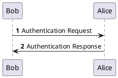
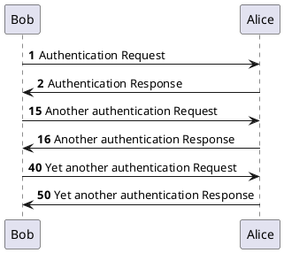
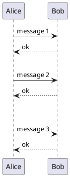

# uml的一些用法

## 对消息序列编号

关键字 autonumber 用于自动对消息编号

```puml
@startuml
autonumber
Bob -> Alice : Authentication Request
Bob <- Alice : Authentication Response
@enduml
```

语句 autonumber //start// 用于指定编号的初始值，而 autonumber //start// //increment// 可以同时指定编号的初始值和每次增加的值。

```puml
@startuml
autonumber
Bob -> Alice : Authentication Request
Bob <- Alice : Authentication Response

autonumber 15
Bob -> Alice : Another authentication Request
Bob <- Alice : Another authentication Response

autonumber 40 10
Bob -> Alice : Yet another authentication Request
Bob <- Alice : Yet another authentication Response

@enduml

```

## 空间

你可以使用|||来增加空间。

还可以使用数字指定增加的像素的数量。

```puml
@startuml

Alice -> Bob: message 1
Bob --> Alice: ok
|||
Alice -> Bob: message 2
Bob --> Alice: ok
||45||
Alice -> Bob: message 3
Bob --> Alice: ok

@enduml

```

